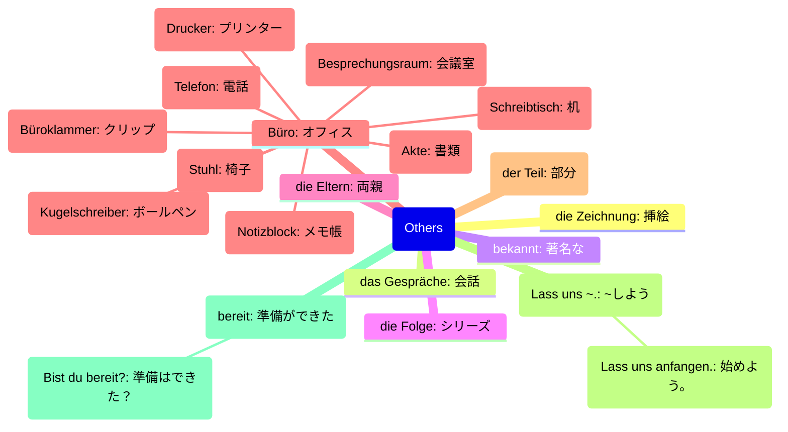
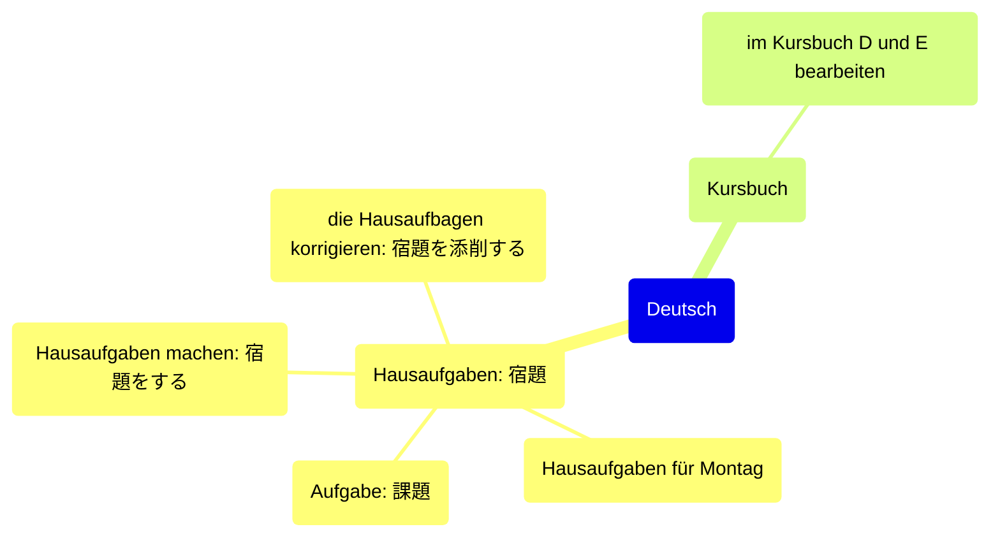
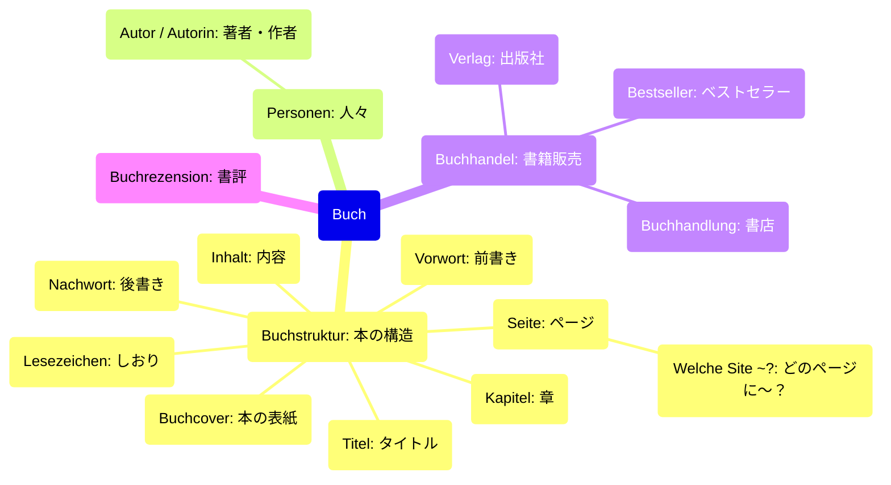

### Others

```mermaid
mindmap
    root(Others)
        die Zeichnung: 挿絵
        das Gespräche: 会話
        bekannt: 著名な
        die Folge: シリーズ
        die Eltern: 両親
        Büro: オフィス
            (Schreibtisch: 机)
            (Stuhl: 椅子)
            (Drucker: プリンター)
            (Telefon: 電話)
            (Akte: 書類)
            (Besprechungsraum: 会議室)
            (Büroklammer: クリップ)
            (Notizblock: メモ帳)
            (Kugelschreiber: ボールペン)
        (der Teil: 部分)
        (Lass uns ~.: ~しよう)
            (Lass uns anfangen.: 始めよう。)
        (bereit: 準備ができた)
            (Bist du bereit?: 準備はできた？)
```

### Housaufgabe

```mermaid
mindmap
    root(Deutsch)
        (Hausaufgaben: 宿題)
            (Hausaufgaben machen: 宿題をする)
            (Hausaufgaben für Montag)
            (Aufgabe: 課題)
            (die Hausaufbagen korrigieren: 宿題を添削する)
        (Kursbuch)
            (im Kursbuch D und E bearbeiten)
```

### Buch

```mermaid
mindmap
    root(Buch)
        (Buchstruktur: 本の構造)
            (Seite: ページ)
                (Welche Site ~?: どのページに〜？)
            (Kapitel: 章)
            (Titel: タイトル)
            (Vorwort: 前書き)
            (Nachwort: 後書き)
            (Inhalt: 内容)
            (Buchcover: 本の表紙)
            (Lesezeichen: しおり)
        (Personen: 人々)
            (Autor / Autorin: 著者・作者)
        (Buchhandel: 書籍販売)
            (Verlag: 出版社)
            (Buchhandlung: 書店)
            (Bestseller: ベストセラー)
        (Buchrezension: 書評)
```