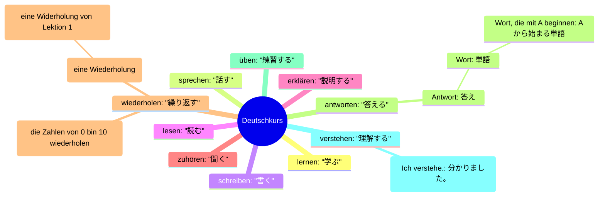

## Dutschkurs

```mermaid
mindmap
  root((Deutschkurs)
    lernen: "学ぶ"
    sprechen: "話す"
    schreiben: "書く"
    lesen: "読む"
    erklären: "説明する"
    zuhören: "聞く"
    wiederholen: "繰り返す"
        (die Zahlen von 0 bin 10 wiederholen)
        (eine Wiederholung)
            (eine Widerholung von Lektion 1)
    antworten: "答える"
        Antwort: 答え
            Wort: 単語
                Wort, die mit A beginnen: Aから始まる単語
    üben: "練習する"
    verstehen: "理解する"
        (Ich verstehe.: 分かりました。)
```