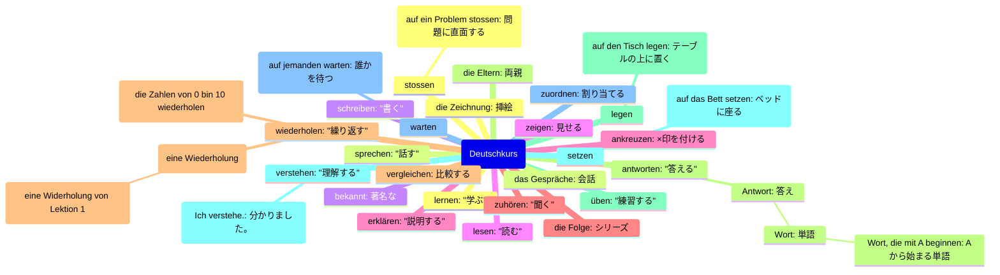

## Dutschkurs

```mermaid
mindmap
  root(Deutschkurs)
    lernen: "学ぶ"
    sprechen: "話す"
    schreiben: "書く"
    lesen: "読む"
    erklären: "説明する"
    zuhören: "聞く"
    wiederholen: "繰り返す"
        (die Zahlen von 0 bin 10 wiederholen)
        (eine Wiederholung)
            (eine Widerholung von Lektion 1)
    antworten: "答える"
        Antwort: 答え
            Wort: 単語
                Wort, die mit A beginnen: Aから始まる単語
    üben: "練習する"
    verstehen: "理解する"
        (Ich verstehe.: 分かりました。)
    zuordnen: 割り当てる
    die Zeichnung: 挿絵
    das Gespräche: 会話
    bekannt: 著名な
    zeigen: 見せる
    ankreuzen: ×印を付ける
    die Folge: シリーズ
    vergleichen: 比較する
    die Eltern: 両親
    legen
        (auf den Tisch legen: テーブルの上に置く)
    setzen
        (auf das Bett setzen: ベッドに座る)
    warten
        (auf jemanden warten: 誰かを待つ)
    stossen
        (auf ein Problem stossen: 問題に直面する)
```
