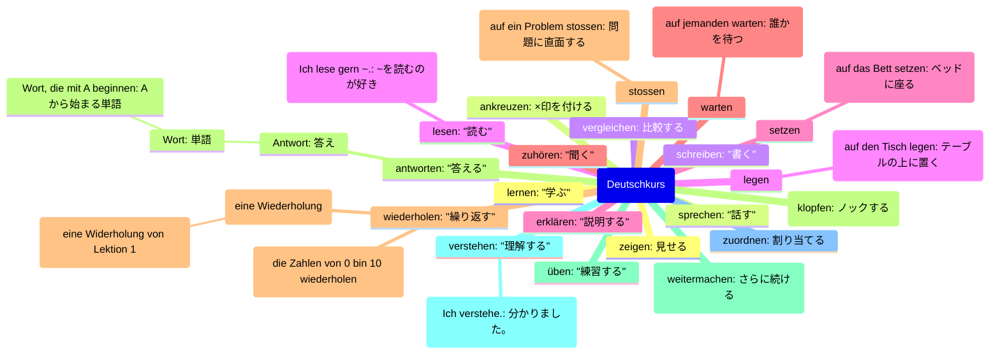
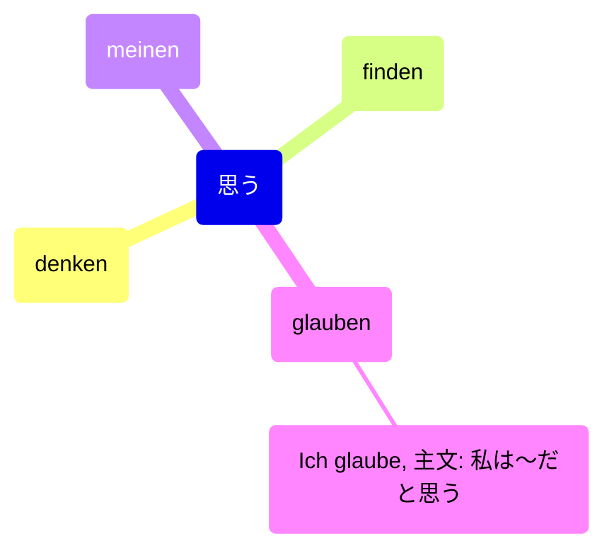
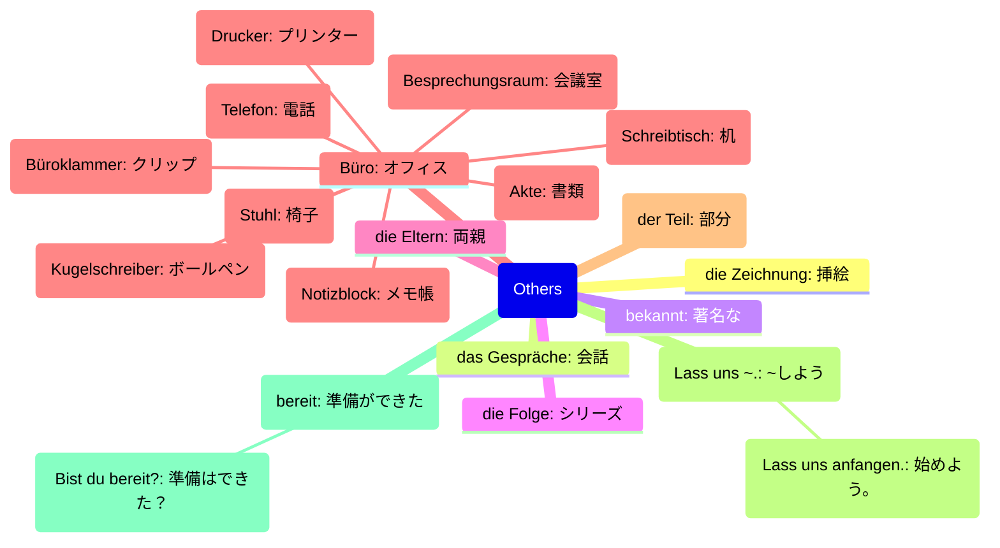

## Dutschkurs

### Verb

```mermaid
mindmap
  root(Deutschkurs)
    lernen: "学ぶ"
    sprechen: "話す"
    schreiben: "書く"
    lesen: "読む"
        (Ich lese gern ~.: ~を読むのが好き)
    erklären: "説明する"
    zuhören: "聞く"
    wiederholen: "繰り返す"
        (die Zahlen von 0 bin 10 wiederholen)
        (eine Wiederholung)
            (eine Widerholung von Lektion 1)
    antworten: "答える"
        Antwort: 答え
            Wort: 単語
                Wort, die mit A beginnen: Aから始まる単語
    üben: "練習する"
    verstehen: "理解する"
        (Ich verstehe.: 分かりました。)
    zuordnen: 割り当てる
    zeigen: 見せる
    ankreuzen: ×印を付ける
    vergleichen: 比較する
    legen
        (auf den Tisch legen: テーブルの上に置く)
    setzen
        (auf das Bett setzen: ベッドに座る)
    warten
        (auf jemanden warten: 誰かを待つ)
    stossen
        (auf ein Problem stossen: 問題に直面する)
    (klopfen: ノックする)
    (weitermachen: さらに続ける)
```

#### 思う

```mermaid
mindmap
    root(思う)
        (denken)
        (finden)
        (meinen)
        (glauben)
            (Ich glaube, 主文: 私は〜だと思う)
```

### Others

```mermaid
mindmap
    root(Others)
        die Zeichnung: 挿絵
        das Gespräche: 会話
        bekannt: 著名な
        die Folge: シリーズ
        die Eltern: 両親
        Büro: オフィス
            (Schreibtisch: 机)
            (Stuhl: 椅子)
            (Drucker: プリンター)
            (Telefon: 電話)
            (Akte: 書類)
            (Besprechungsraum: 会議室)
            (Büroklammer: クリップ)
            (Notizblock: メモ帳)
            (Kugelschreiber: ボールペン)
        (der Teil: 部分)
        (Lass uns ~.: ~しよう)
            (Lass uns anfangen.: 始めよう。)
        (bereit: 準備ができた)
            (Bist du bereit?: 準備はできた？)
```