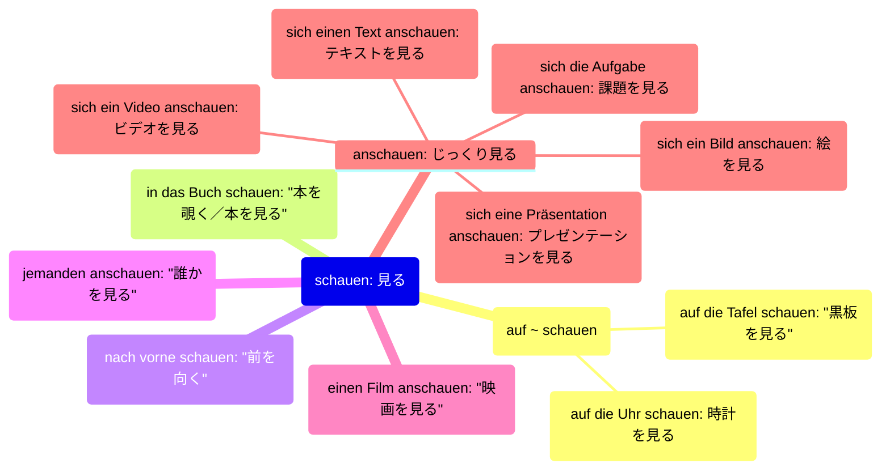

## schauen

```mermaid
mindmap
    root(schauen: 見る)
        (auf ~ schauen)
            (auf die Tafel schauen: "黒板を見る")
            (auf die Uhr schauen: 時計を見る)
        (in das Buch schauen: "本を覗く／本を見る")
        (nach vorne schauen: "前を向く")
        (jemanden anschauen: "誰かを見る")
        (einen Film anschauen: "映画を見る")
        anschauen: じっくり見る
            (sich eine Präsentation anschauen: プレゼンテーションを見る)
            (sich einen Text anschauen: テキストを見る)
            (sich die Aufgabe anschauen: 課題を見る)
            (sich ein Video anschauen: ビデオを見る)
            (sich ein Bild anschauen: 絵を見る)
```