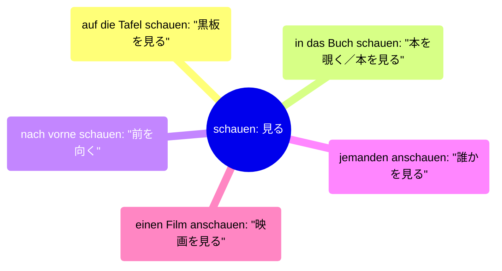

## schauen

```mermaid
mindmap
    root((schauen: 見る))
        (auf die Tafel schauen: "黒板を見る")
        (in das Buch schauen: "本を覗く／本を見る")
        (nach vorne schauen: "前を向く")
        (jemanden anschauen: "誰かを見る")
        (einen Film anschauen: "映画を見る")
```