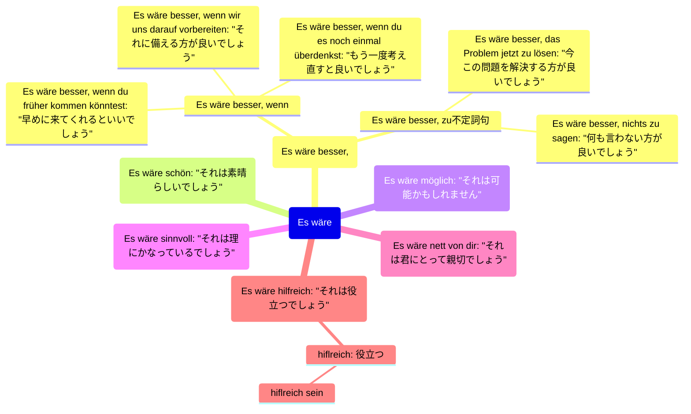
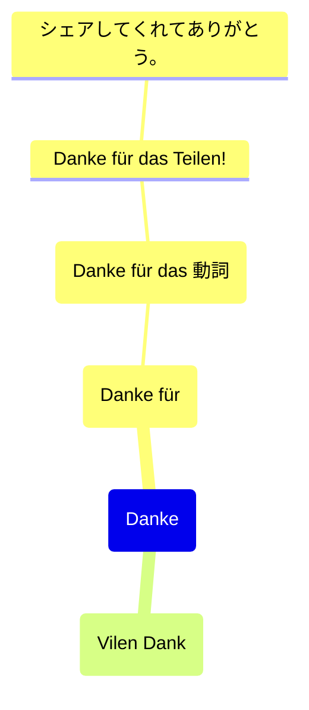

## Es wäre

```mermaid
mindmap
  root(Es wäre)
    (Es wäre besser,)
        Es wäre besser, wenn
            Es wäre besser, wenn du früher kommen könntest: "早めに来てくれるといいでしょう"
            Es wäre besser, wenn wir uns darauf vorbereiten: "それに備える方が良いでしょう"
            Es wäre besser, wenn du es noch einmal überdenkst: "もう一度考え直すと良いでしょう"
        Es wäre besser, zu不定詞句
            Es wäre besser, das Problem jetzt zu lösen: "今この問題を解決する方が良いでしょう"
            Es wäre besser, nichts zu sagen: "何も言わない方が良いでしょう"
    (Es wäre schön: "それは素晴らしいでしょう")
    (Es wäre möglich: "それは可能かもしれません")
    (Es wäre sinnvoll: "それは理にかなっているでしょう")
    (Es wäre nett von dir: "それは君にとって親切でしょう")
    (Es wäre hilfreich: "それは役立つでしょう")
            hiflreich: 役立つ
                hiflreich sein
```

## Danke

```mermaid
mindmap
    root(Danke)
        (Danke für)
            (Danke für das 動詞)
                Danke für das Teilen!
                    シェアしてくれてありがとう。
        (Vilen Dank)
```