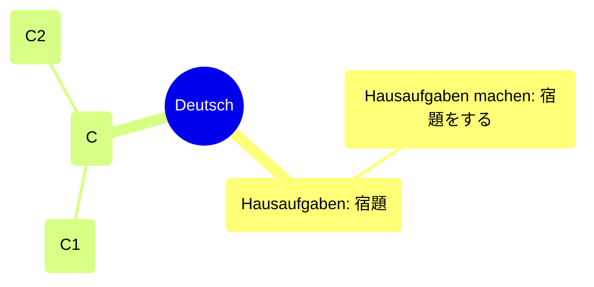
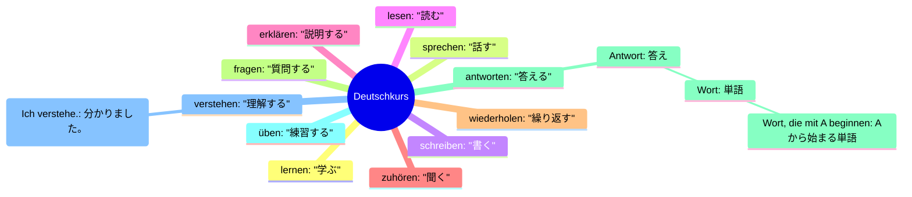
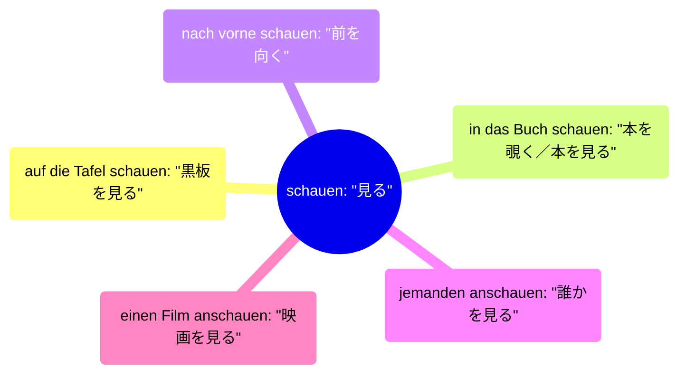
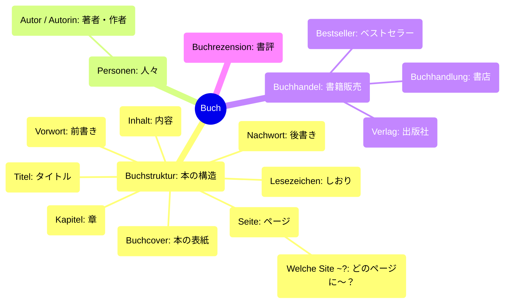
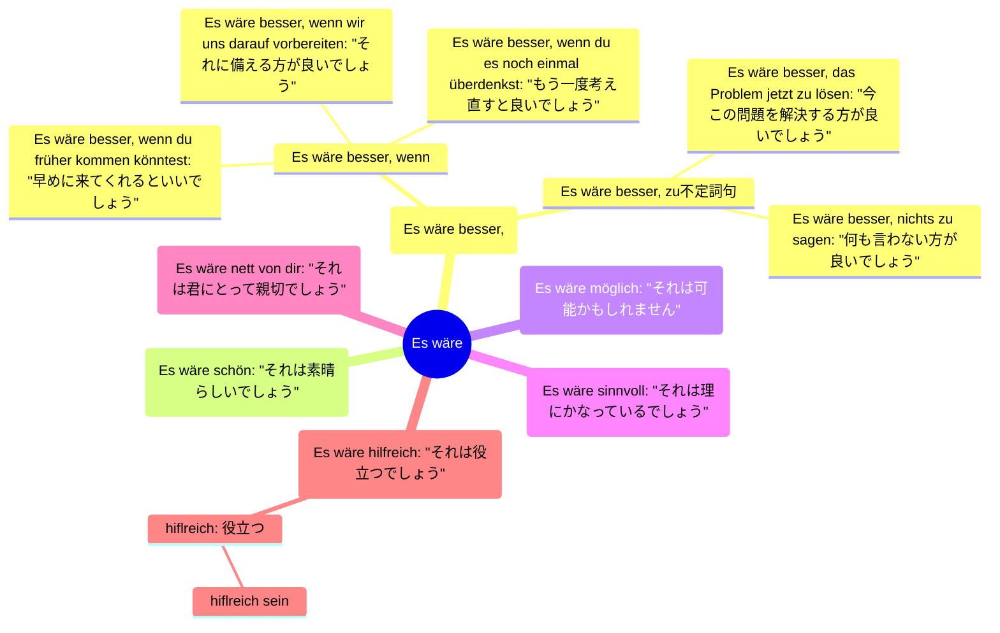
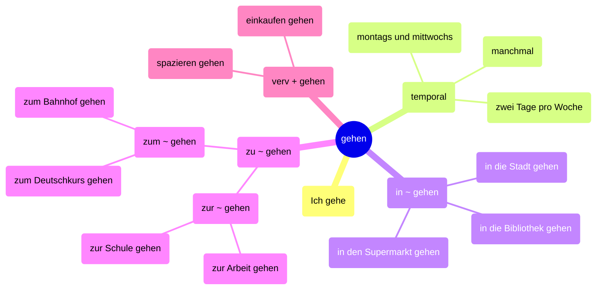

```mermaid
mindmap
    root((Deutsch))
        (Hausaufgaben: 宿題)
            (Hausaufgaben machen: 宿題をする)
        (C)
            (C1)
            (C2)
```

```mermaid
mindmap
  root((Deutschkurs)
    lernen: "学ぶ"
    sprechen: "話す"
    schreiben: "書く"
    lesen: "読む"
    erklären: "説明する"
    zuhören: "聞く"
    wiederholen: "繰り返す"
    fragen: "質問する"
    antworten: "答える"
        Antwort: 答え
            Wort: 単語
                Wort, die mit A beginnen: Aから始まる単語
    üben: "練習する"
    verstehen: "理解する"
        (Ich verstehe.: 分かりました。)
```

```mermaid
mindmap
    root((schauen: "見る"))
        (auf die Tafel schauen: "黒板を見る")
        (in das Buch schauen: "本を覗く／本を見る")
        (nach vorne schauen: "前を向く")
        (jemanden anschauen: "誰かを見る")
        (einen Film anschauen: "映画を見る")
```

```mermaid
mindmap
    root((Buch)
        (Buchstruktur: 本の構造)
            (Seite: ページ)
                (Welche Site ~?: どのページに〜？)
            (Kapitel: 章)
            (Titel: タイトル)
            (Vorwort: 前書き)
            (Nachwort: 後書き)
            (Inhalt: 内容)
            (Buchcover: 本の表紙)
            (Lesezeichen: しおり)
        (Personen: 人々)
            (Autor / Autorin: 著者・作者)
        (Buchhandel: 書籍販売)
            (Verlag: 出版社)
            (Buchhandlung: 書店)
            (Bestseller: ベストセラー)
        (Buchrezension: 書評)
```

```mermaid
mindmap
  root((Es wäre))
    (Es wäre besser,)
        Es wäre besser, wenn
            Es wäre besser, wenn du früher kommen könntest: "早めに来てくれるといいでしょう"
            Es wäre besser, wenn wir uns darauf vorbereiten: "それに備える方が良いでしょう"
            Es wäre besser, wenn du es noch einmal überdenkst: "もう一度考え直すと良いでしょう"
        Es wäre besser, zu不定詞句
            Es wäre besser, das Problem jetzt zu lösen: "今この問題を解決する方が良いでしょう"
            Es wäre besser, nichts zu sagen: "何も言わない方が良いでしょう"
    (Es wäre schön: "それは素晴らしいでしょう")
    (Es wäre möglich: "それは可能かもしれません")
    (Es wäre sinnvoll: "それは理にかなっているでしょう")
    (Es wäre nett von dir: "それは君にとって親切でしょう")
    (Es wäre hilfreich: "それは役立つでしょう")
            hiflreich: 役立つ
                hiflreich sein
```

## Gehen

```mermaid
mindmap
    root((gehen))
        (Ich gehe)
        (temporal)
            (manchmal)
            (zwei Tage pro Woche)
            (montags und mittwochs)
        (in ~ gehen)
            (in den Supermarkt gehen)
            (in die Bibliothek gehen)
            (in die Stadt gehen)
        (zu ~ gehen)
            (zur ~ gehen)
                (zur Arbeit gehen)
                (zur Schule gehen)
            (zum ~ gehen)
                (zum Deutschkurs gehen)
                (zum Bahnhof gehen)
        (verv + gehen)
            (einkaufen gehen)
            (spazieren gehen)
```

- Ich gehe manchmal für meine Gesundheit spazieren.
- Ich gehe zwei Tage pro Woche zum Deutschkurs.
- Ich gehe montags und mittwochs in den Supermarkt.