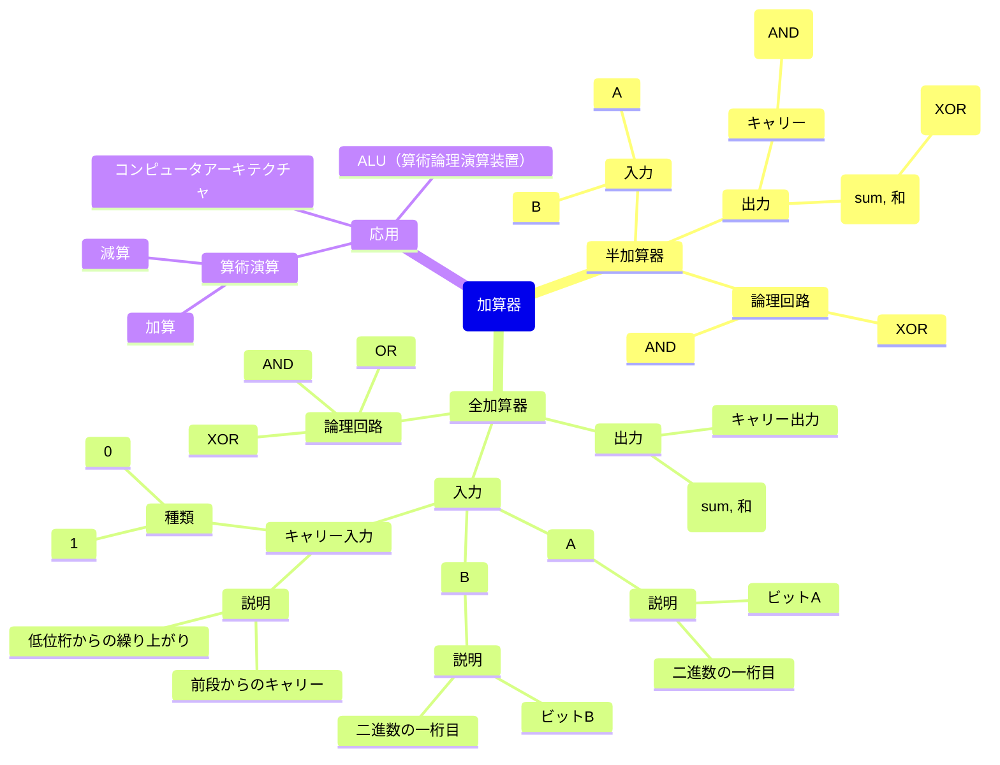

## 基本情報技術者試験

```mermaid
mindmap
    root(加算器)
        半加算器
            入力
                A
                B
            出力
                S(sum, 和)
                    排他的論理和(XOR)
                キャリー
                    論理積(AND)
            論理回路
                XOR
                AND
        全加算器
            入力
                A
                    説明
                        ビットA
                        二進数の一桁目
                B
                    説明
                        ビットB
                        二進数の一桁目
                キャリー入力
                    説明
                        前段からのキャリー
                        低位桁からの繰り上がり
                    種類
                        0
                        1
            出力
                S(sum, 和)
                キャリー出力
            論理回路
                XOR
                AND
                OR
        応用
            算術演算
                加算
                減算
            ALU（算術論理演算装置）
            コンピュータアーキテクチャ
```