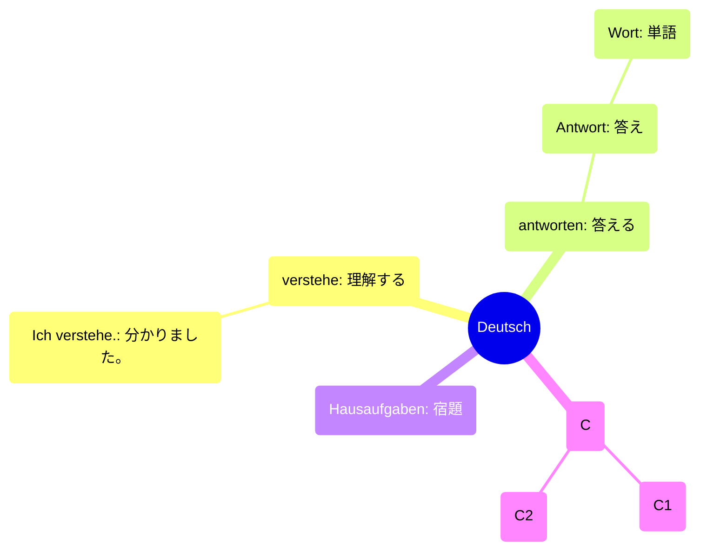

```mermaid
mindmap
    root((Deutsch))
        (verstehe: 理解する)
            (Ich verstehe.: 分かりました。)
        (antworten: 答える)
            (Antwort: 答え)
                (Wort: 単語)
        (Hausaufgaben: 宿題)
        (C)
            (C1)
            (C2)
```
